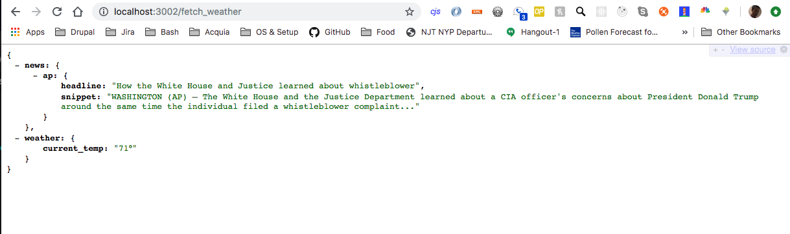

Getting Started
---------------

Simple web scrapper using Google Puppeteer. Scrape/crawl weather and news data from different websites.

```sh
# Install dependencies
npm install

# Start development live-reload server
npm run dev
```

Visit: http://localhost:3002/fetch_weather

